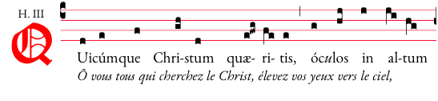

# Generation of medieval scores suited for booklets

## Pluses

- Final scores can be easily integrated in any publishing software, without ruining your layout
- The script makes it easy to make improvements and re-generate the PDFs
- Beautiful Open Source Font
- Good rendering of some rare characters: ǽ, ý, ℟, ℣

## Source files

\*.txt files contain the score (gabc format), the latin and the french translation (separated)

_NB: French translations are from http://www.societaslaudis.org , scores and latin texts are public domain._

\*.gabc files contain the score to be processed 

These \*.gabc files have been generated thanks to [gabc.romanliturgy.org](http://gabc.romanliturgy.org), and the translation quickly added thanks to the advanced functions of _Textmate_.

The parameters were chosen so as to get the best final design

## Script

This script requires Mac OS X and a few softwares to be installed first.

- gregorio: https://github.com/gregorio-project/gregorio
- lualatex
- pdfjam
- pdfcrop
- pdftk
- Fonts:
    + EB Garamond: http://www.georgduffner.at/ebgaramond/ (EB Garamond is free software under the terms of the SIL Open Fonts License (ofl))
    + Diploma, for the initial capitals: http://www.fonts101.com/fonts/view/Fancy/7626/Diploma (unkown license)

## How to use the resulting PDFs?

One file per line has been generated. Copy/paste those files into TextEdit.app, Pages.app (or another software). Depending on your layout, the pagination will be done automatically.

## Evolutions

Fell free to contact me to get examples of final booklets, or if you want to adapt this method for another language.

If needed I can design a webapp to further simplify this process.
